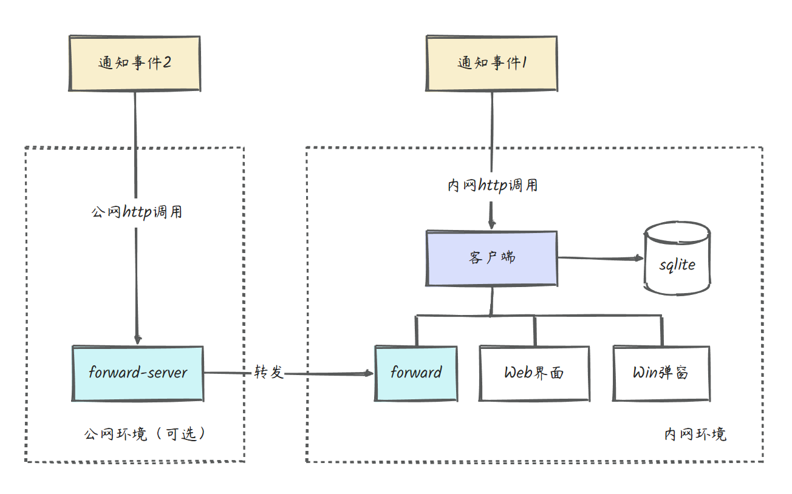
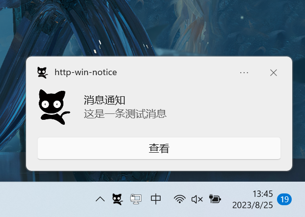

<p align="center">
  
  <h2 align="center">HTTP Windows消息通知</h2>
</p>

<div align="center">


  
</div>

> 一个运行在Windows本机的服务，监听http接口请求触发windows消息通知


## 功能

- [x] http接口请求
- [x] Windows 消息弹窗
- [x] 历史消息记录
- [x] 开机启动
- [x] 托盘控制
- [x] 端口配置
- [x] frp内网穿透集成
- [x] 公网调用


## 架构



- 内网环境下，局域网内可通过内网ip+端口调用，如`http://192.168.124.11:19000`
- 公网环境可选择开启（默认关闭），配置开启后公网内可通过`frps`所在服务器公网ip+映射端口调用，如`http://123.123.1.2:19001`，此时请求经过公网服务器的frps服务转发给本机的frpc，frpc再将请求转发给本地web服务从而触发消息通知。详情查看[开启frp内网穿透](#开启frp内网穿透)


## 使用

1. 直接下载编译后的exe文件
2. 双击exe启动
3. 右击托盘图标勾选开机启动
4. 通知调用
   - 方式1
   
     浏览器输入链接`http://127.0.0.1:19000/api/toast?msg=哈喽，我是新的消息通知`
   - 方式2 (python调用示例)
   
     ```python
     import requests
        
     title = "自定义通知标题"
     msg = "我是测试消息通知啦啦啦啦啦"
     res = requests.get(f"http://127.0.0.1:19000/api/toast?msg={msg}&title={title}")
     print(res.json())
       ```
     详情可见 [接口文档](#接口文档)
5. 可右击托盘图标，点击配置文件修改端口号
6. 可打开web界面查看历史消息记录

## 效果

- 程序运行

  


- 调用http消息通知接口

  

- 消息通知记录

  

## 接口文档

#### 发送通知

- API: `http://hostname:port/api/toast`
- 请求方式：`GET`
- 请求参数

| 参数名      | 默认值      | 解释                             |
|----------|----------|--------------------------------|
| title    | 消息通知     | 通知标题                           |
| msg      | 这是一条测试消息 | 通知内容                           | |
| remark   | 空        | 备注                             | |
| icon     | 0        | 图标索引，配合配置文件使用                  |
| duration | short    | 持续时长，short-短，大概6秒 long-长，大概25秒 |
| audio    | default  | 声音                             |

其中`icon`需修改配置文件，参考配置如下：
```yaml
toast:
  icons:
    - logo.png
    - logo2.png
```
此时传`icon=1`表示使用`logo2.png`图标，图标图片需放在`config.yml`同级的`images`目录内

<details>
<summary>audio的参数可选值如下：</summary>

| 值              | 描述             |
|----------------|----------------|
| default        | Default        |
| im             | IM             |
| mail           | Mail           |
| reminder       | Reminder       |
| sms            | SMS            |
| loopingalarm   | LoopingAlarm   |
| loopingalarm2  | LoopingAlarm2  |
| loopingalarm3  | LoopingAlarm3  |
| loopingalarm4  | LoopingAlarm4  |
| loopingalarm5  | LoopingAlarm5  |
| loopingalarm6  | LoopingAlarm6  |
| loopingalarm7  | LoopingAlarm7  |
| loopingalarm8  | LoopingAlarm8  |
| loopingalarm9  | LoopingAlarm9  |
| loopingalarm10 | LoopingAlarm10 |
| loopingcall    | LoopingCall    |
| loopingcall2   | LoopingCall2   |
| loopingcall3   | LoopingCall3   |
| loopingcall4   | LoopingCall4   |
| loopingcall5   | LoopingCall5   |
| loopingcall6   | LoopingCall6   |
| loopingcall7   | LoopingCall7   |
| loopingcall8   | LoopingCall8   |
| loopingcall9   | LoopingCall9   |
| loopingcall10  | LoopingCall10  |

</details>


## 开启frp内网穿透

- 开启frp需要有一台带公网ip的服务器，配置并开启后可实现公网调用接口发送通知。

- 客户端内已集成了`frpc（v0.51.3）`

#### 服务端配置

1. 下载`frps`，选择对应服务器版本即可。[下载地址](https://github.com/fatedier/frp/releases/tag/v0.51.3)
2. 修改`frps.ini`配置文件，配置参考：

- frps.ini
```ini
[common]
bind_port = 7000
token = httpwinnotice123456
```
3. 启动服务端：

```bash
chmod +x ./frps
./frps -c frps.ini
```

#### 客户端配置

1. 右击托盘图标选择`配置文件`，修改配置文件内`frp`相关内容并保存。参考配置如下：
    
```yaml
frp:
    enable: 1
    server_addr: 123.123.1.2
    server_port: 7000
    token: httpwinnotice123456
    remote_port: 19001
```

配置的各项解释如下：

- enable: 1-开启frp，0-关闭frp
- server_addr: 部署frps服务器的公网ip
- server_port: frps服务端口号
- token: 与服务器端配置token一致，建议将默认值修改
- remote_port: 转发的远端端口号

注意服务器防火墙放开对应的端口号，以上示例配置在公网调用时使用`http://123.123.1.2:19001/api/toast`

配置好后重启程序即可

#### 测试

浏览器打开`http://123.123.1.2:19001/api/toast?msg=哈喽` 如果windows通知出现证明开启成功（ip和端口号替换为自己的）